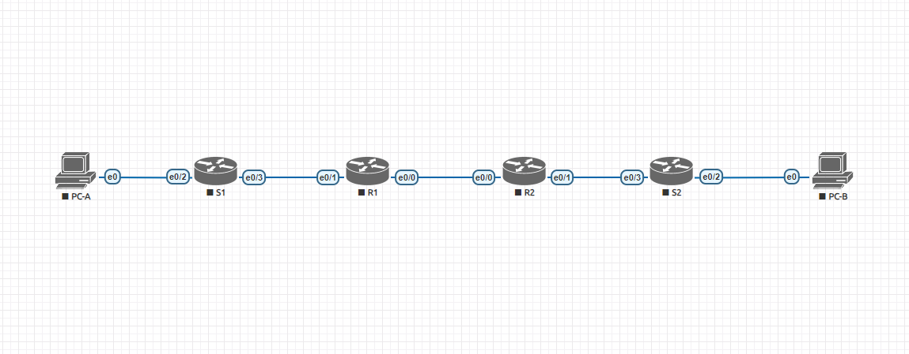
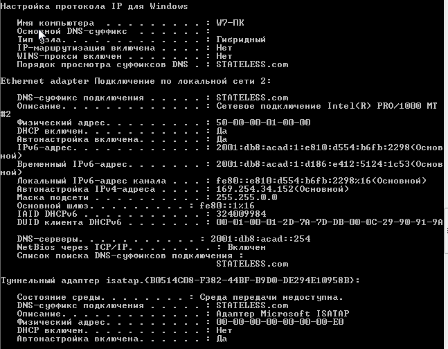
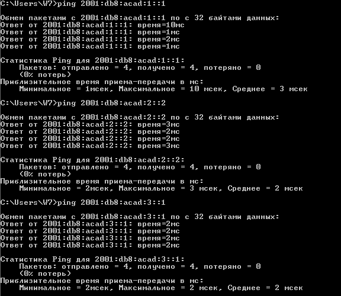
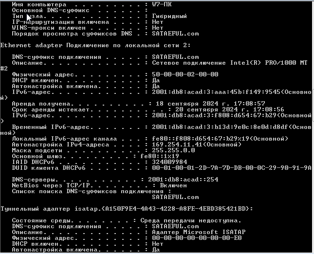
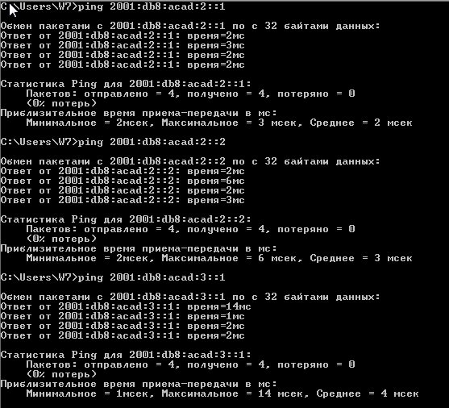
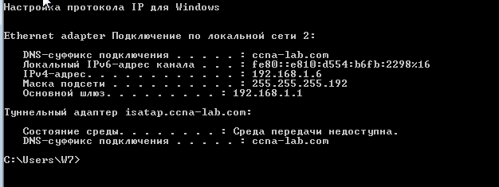
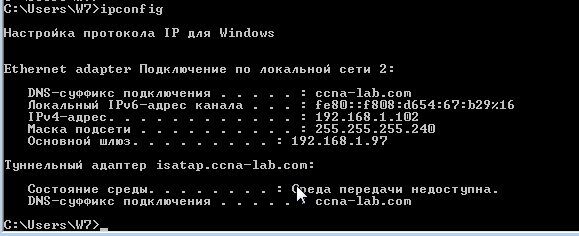

# *ТЕМА: DHCPv4/v6 и SLAAC*

## Собрать сеть и произвести базовые настройки и сопутствующие настройки согласно заданию LAB - "Configure DHCPv6".

### Шаг первый:

Соединить оборудование согласно топологии в задании.

### Шаг второй:

Сделать базовые настройки каждого свича.

[SW1](DHCPv6/S1.txt)

[SW2](DHCPv6/S2.txt)

### Шаг третий, действия на R1:

Сделать базовые настройки каждого роутера. Назначить адреса на интерфейсы. Сделать так чтобы PC-A назначил себе адрес по SLAAC. Сделать так чтобы PC-A получил по DHCP адрес DNS сервера и имя домена. 

[R1](DHCPv6/R1.txt)

### Шаг четвертый, действия на R2:

Cделать базовые настройки каждого роутера. Настроить интерфейсы. Сделать настройку DHCP Relay. Сделать так чтобы PC-B получил адрес интерфейса по DHCP от R1.

[R2](DHCPv6/R2.txt)

### Проверка настроек на хостах:

#### PC-A

#### PC-B

## Собрать сеть и произвести базовые настройки и сопутствующие настройки согласно заданию LAB - "Configure DHCPv4".

### Шаг первый:

Соединить оборудование согласно топологии в задании.

### Шаг второй:

Сделать базовые настройки каждого свича и конфигурирование согласно заданию.

  Выполнена настройка S1. Сделаны базовые настройки. Настроен интерфейс access vlan 100 для подключения в него ПК. Настроен интерфейс access vlan 999 Parking Lot. Настроен транковый интерфейс до роутера. Создан Vlan интерфейс для менеджмента свича.

  [S1](DHCPv4/S1.txt)

  Выполнена настройка S2. Сделаны базовые настройки. Настроены два интерфейса access vlan 999 Parking Lot. Создан Vlan1 интерфейс Client_LAN прописан маршрут по умолчанию к некст хопу. Остальные порты остаются не тронуты.

  [S2](DHCPv4/S2.txt)

  ### Шаг третий:

  Сделать базовые настройки каждого роутера и конфигурирование согласно заданию.

  Выполнена настройка R1. Сделаны базовые настройки. Настроен линковочный интерфейс для соединения роутера с соседним. Настроен субинтерфейс для который будет служить шлюзом для клиентских ПК. Согдан субинтерфейс для менеджмента роутера. Создан субинтерфейс Native LAN. Настроен маршрут по умолчанию до соседнего роутера. Созданы два DHCP сервера. Один для клиентов за портом e0/1, второй для relay из соседнего роутера.

  [R1](DHCPv4/R1.txt)

  Выполнена настройка R2. Сделаны базовые настройки. Настроен линковочный интерфейс для соединения роутера с соседним. Создан интерфейс который будет использоваться в качестве шлюза по умолчанию для клиентских ПК, таже на нем настроен DHCP relay. астроен маршрут по умолчанию до соседнего роутера.

  [R2](DHCPv4/R2.txt)

  ### Шаг четвертый:

Тестирование хостов.

Обе стороны получают настройки интерфейсов по DHCPv4

## PC-A

## PC-B

